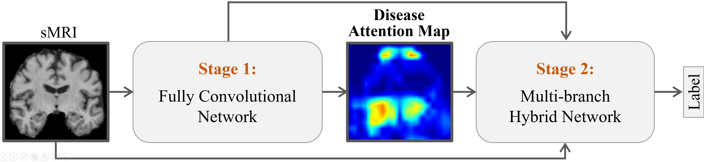
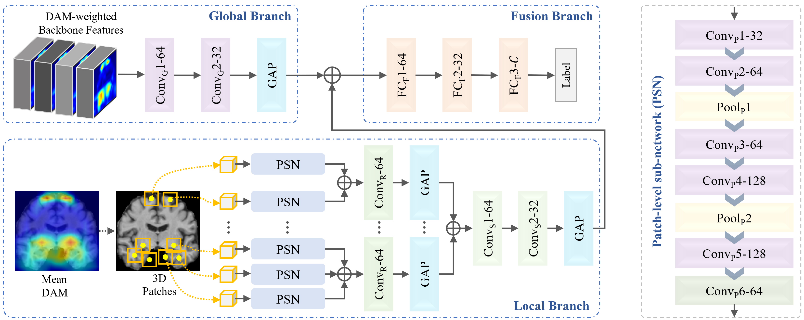

# HybNet
Attention-Guided Hybrid Network for Brain Disease Diagnosis with Structural MR Images

<p align="center">  </p>
<p align="center"> A two-stage framework consisting of localization and diagnosis </p>
<p align="center">  </p>
<p align="center"> HybNet in the stage of diagnosis </p>

## Introduction
We propose an attention-guided deep learning framework to extract multi-level discriminative sMRI features for brain disease diagnosis. Specifically, we first design a backbone fully convolutional network to automatically localize the discriminative brain regions in a weakly-supervised manner. Using the identified disease-related regions as spatial attention guidance, we further develop a hybrid network to jointly learn and fuse multi-level sMRI features for CAD model construction.

## Installation
Python 2.7, Keras 2.1.0, TensorFlow 1.10.0, CUDA 9.0 and on Ubuntu 16.04.

Dependencies: SimpleITK, numpy, scipy ...

## Examples
To produce CAM with the backbone FCN:
```
python train_cam.py --gpu 0 --batch_size 2 --num_epochs 100 --img_path xxx
```
```
python generate_cam.py --gpu 0 --resume './saved_model/stage1_backbone.best.h5'
```

Construct HybNet for diagnosis:
```
python call_hybnet.py --gpu 0 --batch_size 2 --img_path xxx
```
Notably, each sub-network of HybNet should be trained in the fashion of deep suprvision to optimize its performance.
